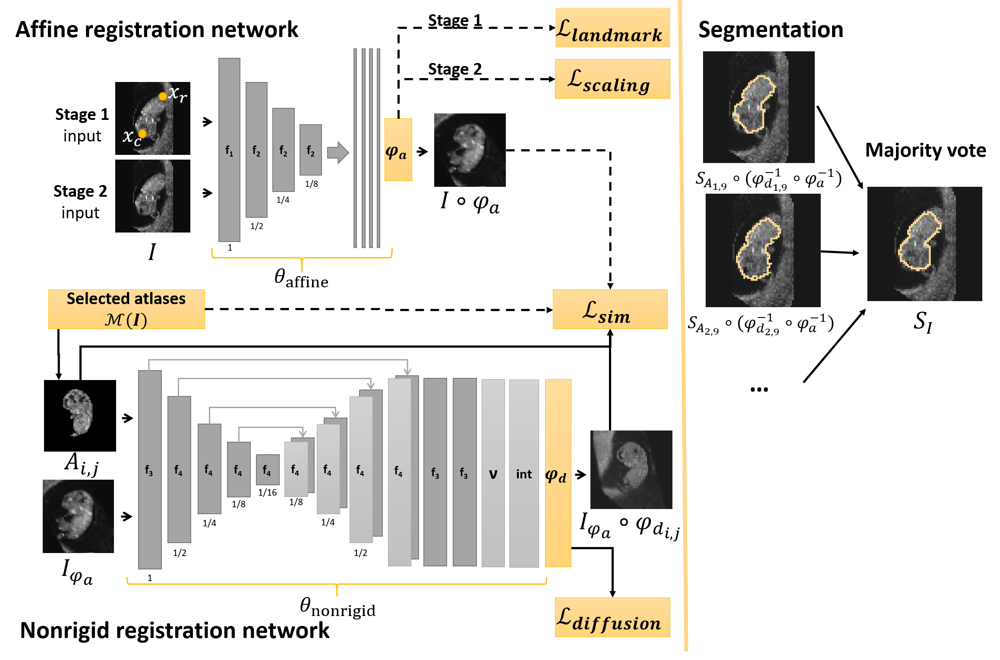

# multi-atlas-seg-reg: Multi-Atlas Segmentation and Registration



This is the repository for the Multi-Atlas Segmentation and Registration pipeline, part of the PhD project of [Wietske Bastiaansen](mailto:w.bastiaansen@erasmusmc.nl).

We propose an atlas-based segmentation framework to achieve segmentation and spatial alignment of three-dimensional ultrasound images of the human embryo acquired during the first trimester of pregnancy. Our framework is based on deep learning with minimal supervision. The framework consists of two networks, one dedicated to learning an affine transformation and one dedicated to learning a nonrigid deformation. The affine registration network is trained in two stages, were the first stage is minimally supervised and the resulting transformation is refined in the second unsupervised stage. The nonrigid registration network is trained completely unsupervised and in one stage. Our framework supports the use of multiple atlases, the selected atlases per image are the M atlases closest in (gestational) age.

## Get started

Our code is build on top of the [legacy branch of Voxelmorph](https://github.com/voxelmorph/voxelmorph/tree/legacy). To use our code download from the ext folder medipy-lib, neuron, pynd-lib and pytools-lib. The other files (losses, networks, dataloaders) are based on the structure imposed by the original Voxelmorph code. Note that other losses, networks or dataloaders present in Voxelmorph can be used here.

Install the following:
- Install [python3](https://docs.python.org/3/index.html) (recommended version 3.6)
- Install the requirements:
```bash
pip install -r requirements.txt
```

## Usage

The core of the code has 6 entry points `multi_{affine,nonrigid}/main_{train,register,eval}.py.

To display the help of one of the entry points (e.g. `multi_affine/main_train`)launch the following command:

```bash
$ (export) PYTHONPATH=./lib:./ python multi_affine/main_train --help
usage: main_train.py [-h] [--datadir DATADIR] [--atlasdir ATLASDIR] [--slurmid SLURMID] [--experimentid EXPERIMENTID] [--numiter NUMITER] [--stage STAGE]
                     [--regparam REGPARAM][--loadmodel LOADMODEL] [--m M] [--atlaslist ATLASLIST [ATLASLIST ...]] [--flip FLIP]
                     [--rot90 ROT90] [--outputdir OUTPUTDIR] [--enc ENC]

Launch training

optional arguments:
  -h, --help            show this help message and exit
  --datadir DATADIR     directory containing the data for training, folders with mask and atlases
  --atlasdir ATLASDIR   directory containing the atlases
  --slurmid SLURMID     slurm id of the job
  --experimentid EXPERIMENTID
                        experiment id
  --numiter NUMITER     number of iterations for training
  --stage STAGE         the number of the stage launched for training
  --regparam REGPARAM   value of the regularization parameter
  --loadmodel LOADMODEL
                        model to preload for training
  --m M                 Number of atlases for optimization
  --atlaslist ATLASLIST [ATLASLIST ...]
                        list id of used atlases
  --flip FLIP           0: no flips applied as data augmentation, 1: flips applied
  --rot90 ROT90         0: no 90 degree rotation are applied, 1: 90 degree rotations
  --outputdir OUTPUTDIR
                        directory to save output
  --enc ENC             number of filters in first layer enc
```

## How to test the code
- To test the code launch the following commands
```bash
$ python -m pytest test_affine
$ python -m pytest test_nonrigid
```
## Assummed data structure
The following data structure is assumed. Training, validation and test images are in folders named: data_dir\train, data_dir\val, data_dir\test, we assume the images to be nifti files. We assume every image to have an '.npz' file containing the GA and annotations of the two landmarks.

The atlas images are in the folder atlas_dir, with subfolders \seg, for the segmentations of the atlas images, \landmark, where the landmark coordinates in atlas-space are saved. We asume that the ground truth landmarks are saved in 'ground_truth_landmark.npz', with 'A_t' the crown (top) landmark and 'A_b' the rump (bottom) landmark. Finally also a folder \mask is present, where the mask to evaluate the similairity loss is stored.

To run the evaluation we use the seg_dir folder to store the ground truth segmentations, prepro_dir is a folder where the scaling factors and zero-padding of the preprocessing of every image is saved: this is needed to calculate the embryonic volume.

## How to perform multi-atlas strategies presented in the paper
Assume you have longitudional data of ID-1 till ID-n pregnancies/patients/... . Note that M stands for the number of atlases you want to include per image. The selected M atlases are closest in (gestational) age, or other metadata.

| Strategy | `--atlaslist` | `--m` |
--- | --- | --- |
|single atlas | ID-1 | 1 |
|multi-atlas | ID-1, ..., ID-n | M |
|ensemble | ID-k | 1 |


## Contribute

To contribute:
- send a pull request or raise an issue on this repository
- contact me per [mail](mailto:w.bastiaansen@erasmusmc.nl)

## Authors
- [Wietske Bastiaansen](https://github.com/wapbastiaansen)

## References
If you use (parts) of the code, please cite:
[To be filled]()

More references and recorded talks on parts of the code:
- **Development of affine network:** [Bastiaansen, W. A., Rousian, M., Steegers-Theunissen, R. P., Niessen, W. J., Koning, A., & Klein, S. (2020, December). Towards segmentation and spatial alignment of the human embryonic brain using deep learning for atlas-based registration. In International Workshop on Biomedical Image Registration (pp. 34-43). Springer, Cham.](https://arxiv.org/abs/2005.06368) [**recorded talk**](https://www.youtube.com/watch?v=3ez-dGklAno&feature=youtu.be)
- **Minimal supervison and two stage approach:** [Bastiaansen, W. A., Rousian, M., Steegers-Theunissen, R. P., Niessen, W. J., Koning, A., & Klein, S. (2020). Atlas-Based Segmentation of the Human Embryo Using Deep Learning with Minimal Supervision. In Medical Ultrasound, and Preterm, Perinatal and Paediatric Image Analysis (pp. 211-221). Springer, Cham.](https://link.springer.com/chapter/10.1007/978-3-030-60334-2_21) [**recorded talk**](https://www.youtube.com/watch?v=CKQvJK-S2bQ&t=2s)


